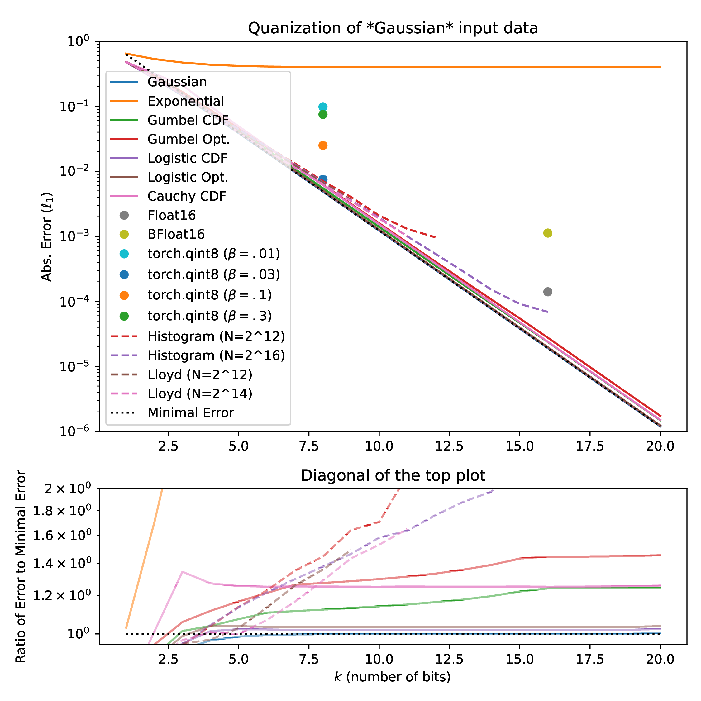
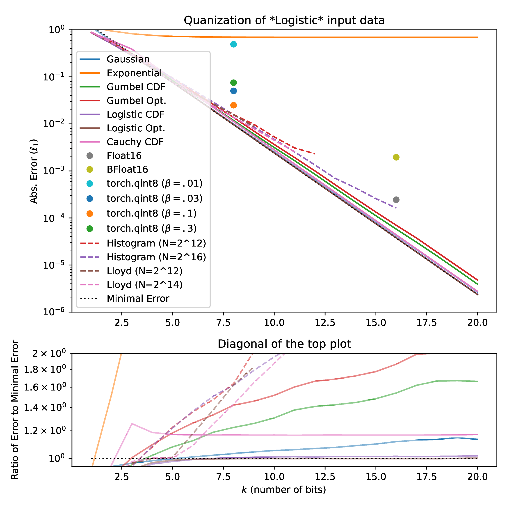
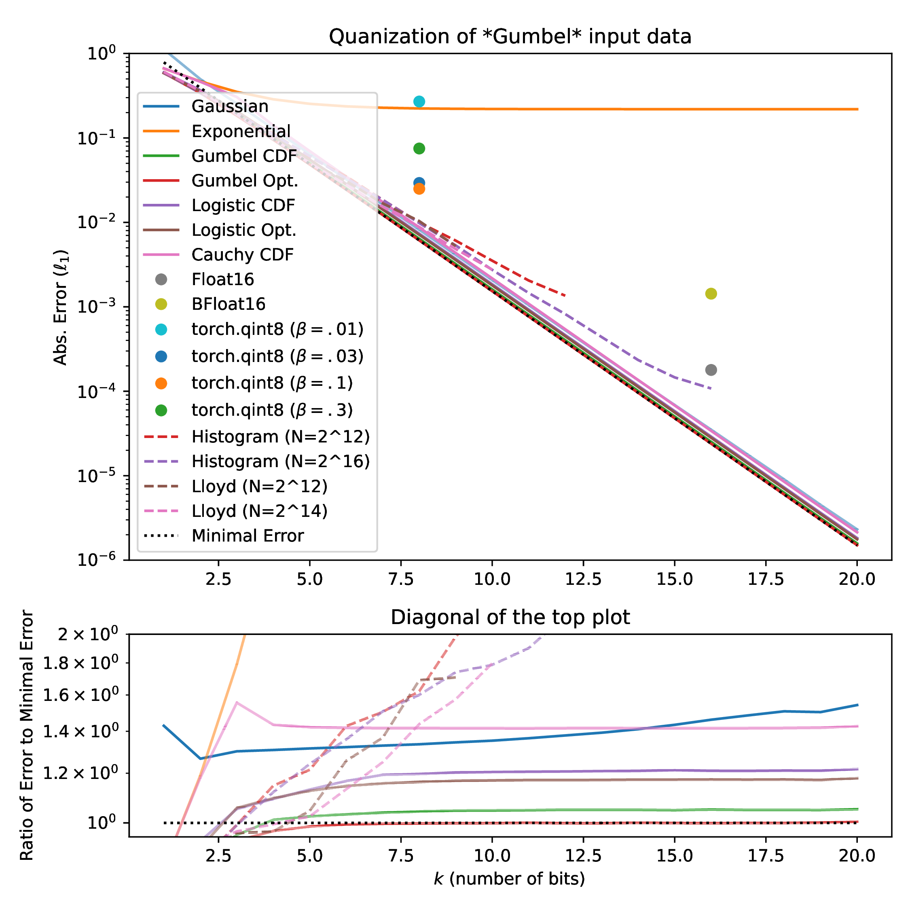
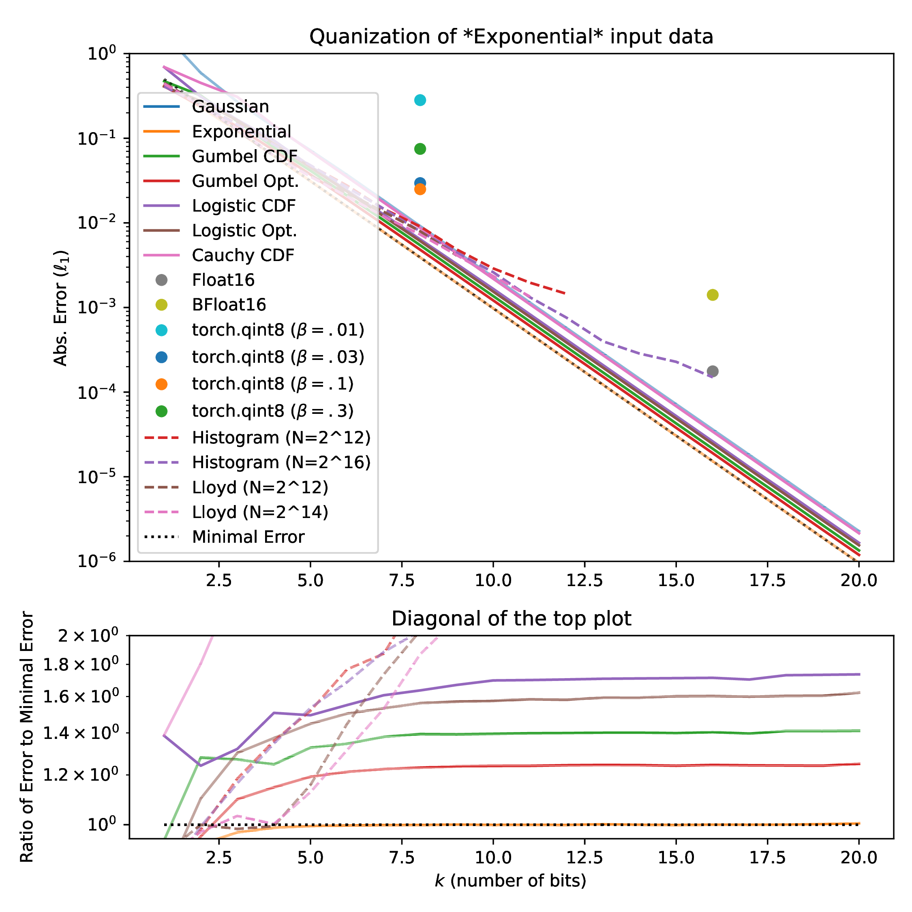

# Distributional Quantization Simulation Plots

On this page, we present simulation-based quantization performance plots.
In particular, we compare distributional quantization for 1 to 20 bits to *Float16*, *BFloat16*, *qint8*, *histogram*-based quantization, and *Lloyd* max quantization.
We can observe that distributional quantization consistently outperforms the baselines.
Compared to Histogram and Lloyd max approaches, we can see that distributional quantization is more scalable.
In particular, for Histogram and Lloyd, lookup tables need to be stored and the computation of said lookup tables becomes increasingly more expensive for larger bit-widths.
Further, we can see that the theoretically optimal quantization approach also consistently performs best.

---

---

---

---

